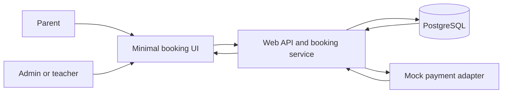
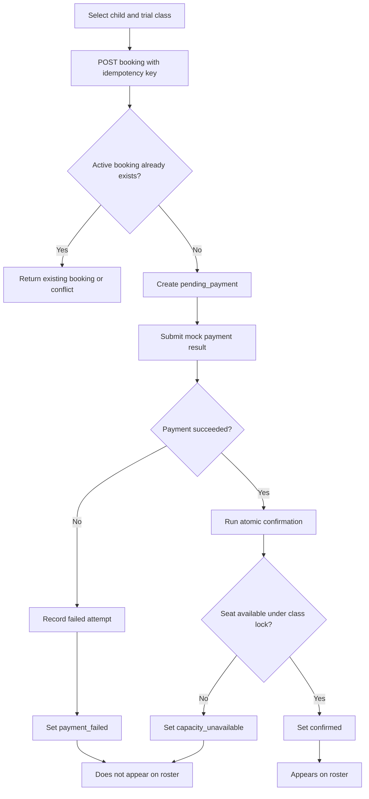
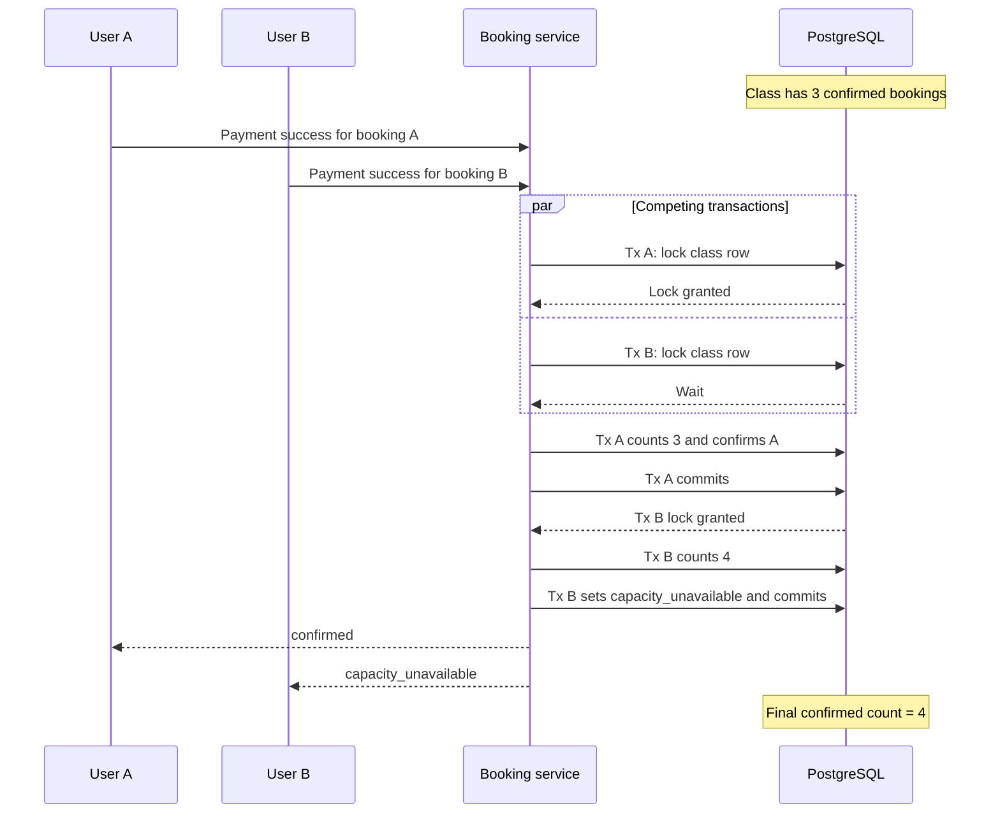
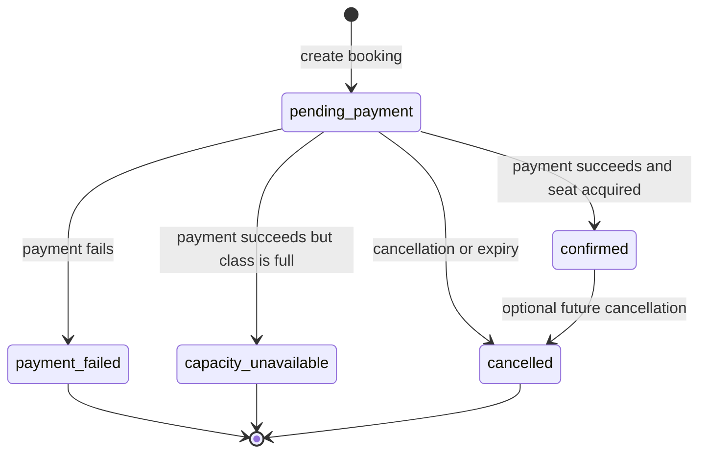
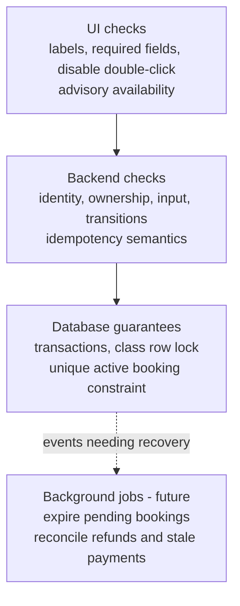
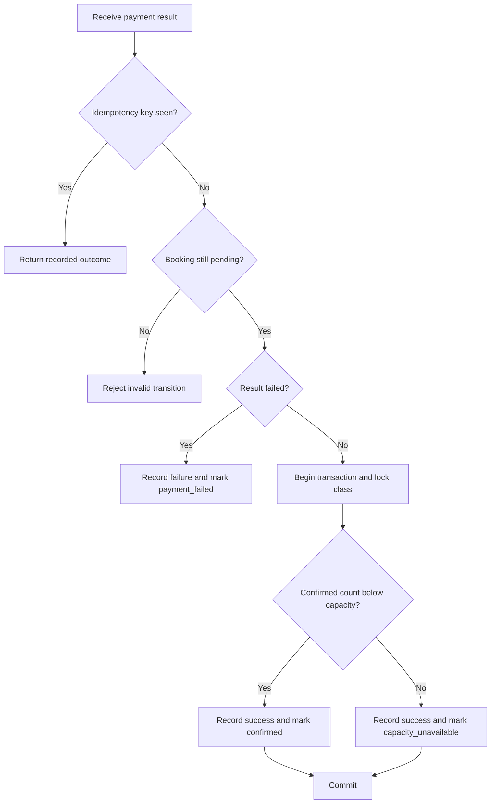
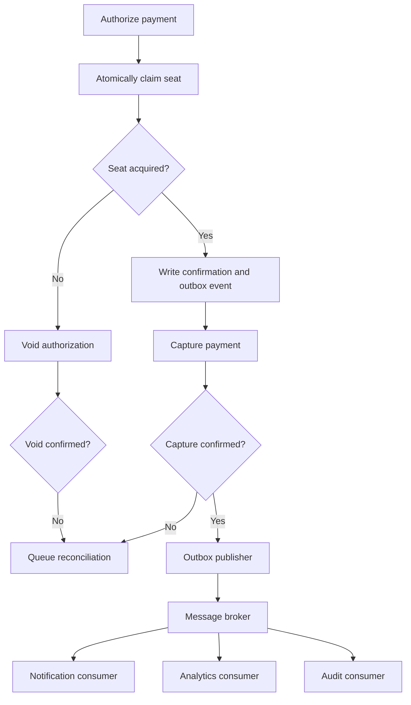

# Flowcharts

These Mermaid diagrams are documentation artifacts; they do not prescribe a particular framework.

## System context

## Happy path and payment failure

## Last-seat race sequence

The winner may be A or B. The invariant is that exactly one wins.

## Booking state machine

For the demo, terminal states reject contradictory later payment results. A new booking may be created after a failed, unavailable, or cancelled booking.

## Authority by layer

## Payment-to-seat decision

## Production evolution: Saga-like compensation and optional event streaming

The implemented take-home stops at the synchronous database-backed flow shown earlier. This production diagram is intentionally future-facing. The broker is not assumed to be Kafka; Kafka becomes a candidate only when replay, throughput, ordering, retention, and independent-consumer requirements justify it.
